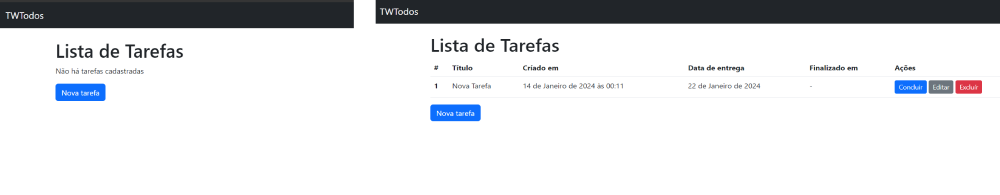

# Criando uma aplicação de lista de tarefas com todos os metodos HTTP

Nesta vídeo aula, adquiri conhecimentos sobre o uso do Django, um framework em Python destinado ao desenvolvimento de aplicações, com destaque para a criação de uma aplicação de lista de tarefas integrada a um banco de dados SQLite, além de diversas outras bibliotecas.

Ao longo do tutorial, compreendi a estrutura de separação entre modelo, view e controle no Django, explorando também configurações essenciais como o uso de arquivos .env, a gestão de ambientes virtuais (venv), as configurações do projeto (settings), e diversos outros aspectos fundamentais para o desenvolvimento eficiente.

Este aprendizado abrangeu uma ampla gama de tópicos, proporcionando uma compreensão mais profunda e abrangente do Django e suas funcionalidades.

https://www.youtube.com/watch?v=MsUL3Pgofl4

## Bibliotecas e configurações utilizadas 

#### Criando ambiente virtual de Python no Windows
````
python -m venv .lista-python
````

#### Entrando no ambiente virtual Venv
````
.\.lista-python\Scripts\activate
````

#### Biblioteca do Django
````
pip install django
````

#### Startando o projeto Django
````
django-admin startproject setup .
````

#### Rodando o servidor (Precisa está dentro do ambiente virtual Venv)
````
python manage.py runserver
````

#### Iniciar um novo app dentro do Django
````
python manage.py startapp todos
````

#### Comando para criar as tabelas no banco de dados.
````
python manage.py migrate
````

##### Comando para criar as tabelas depois de definidas no modelo no banco de dados
````
python manage.py makemigrations
````

##### Biblioteca para gerar o arquivo .env no projeto
````
pip install python-decouple
````

##### Biblioteca para configurar o banco de dados em variável de ambiente
````
pip install dj-database-url
````

#### Biblioteca para padronizar e formatar o código
Para utilizar e formatar todo o código basta abrir o termonal e digitar: black .
````
pip install black
````

##### Biblioteca para estilizar os formulários para bootstrap5
````
pip install crispy-bootstrap5
````